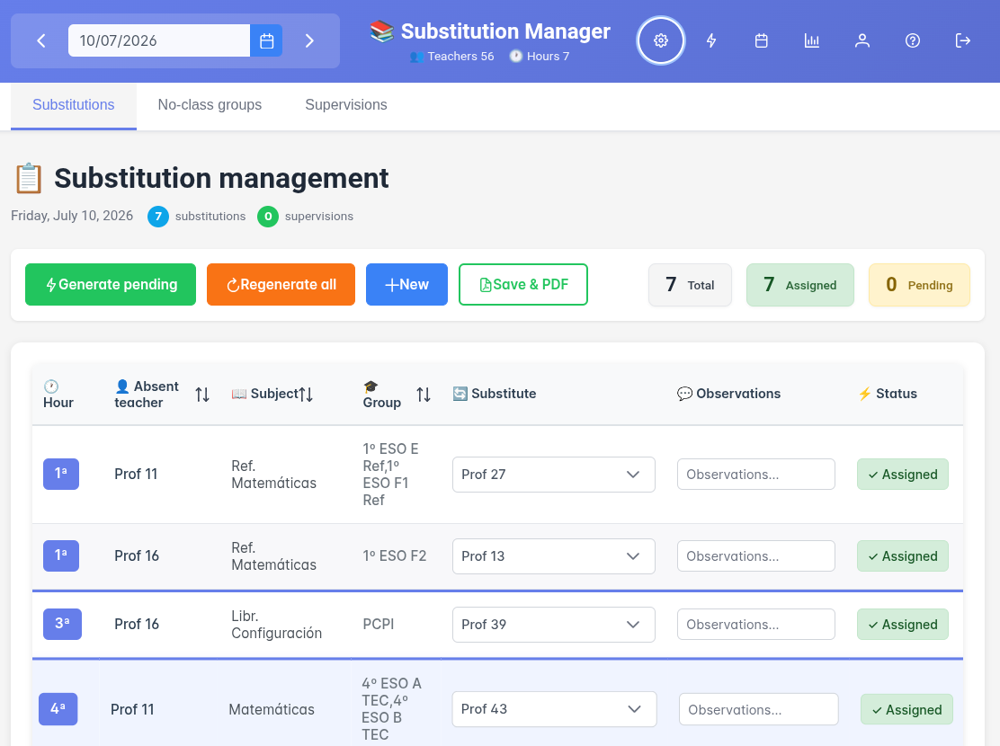
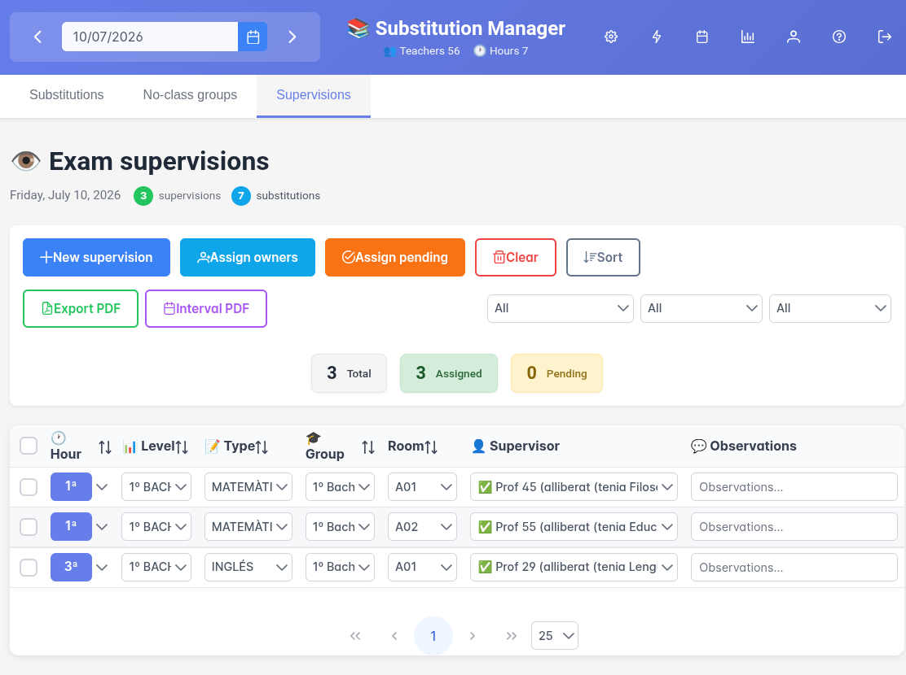
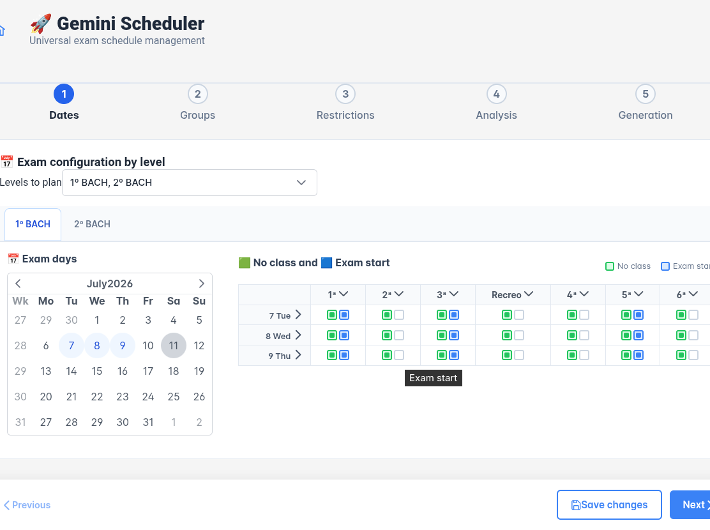

# Teacher Cover, Substitutions & Exam Invigilation Manager

> **Open-source** web app to organise **teacher cover / substitutions** and
> **exam invigilation** in a school: automatic, fair duty assignment, PDF reports
> and timetable import from [FET](https://lalescu.ro/liviu/fet/).

[Català](README.md) · [Castellano](README.es.md) · **English**

[](LICENSE)


**Live demo:** [gestor.alienamrt.org](https://gestor.alienamrt.org) — log in with `user_demo` or `admin_demo` (to see the admin features), password `demo1234`. _The demo resets daily._

<!--
  Keywords (for search discovery):
  teacher cover supervision · substitute teacher scheduling · relief teacher ·
  exam invigilation scheduler · invigilation rota · teacher absence management ·
  gestión de guardias y sustituciones · gestió de guàrdies i substitucions.
-->

If you are looking for **cover supervision software**, a **substitute teacher
scheduler** or a tool to build a fair **exam invigilation rota**, this project
covers the whole workflow in a single, self-hostable, free application.

---

## Screenshots

| Daily substitutions | Invigilation & groups | Exam scheduler |
|---|---|---|
|  |  |  |

> _Screenshots use the sample institution (`Prof 1`, `Prof 2`…); no real data._

---

## Features

- **Daily cover & substitutions** with automatic substitute assignment
- **Exam invigilation** and management of groups without class
- **Fair workload distribution** based on load and configurable constraints
- **PDF export** (substitutions, invigilation, intervals, management reports)
- **Exam scheduler** with automatic optimisation (3 generation engines)
- **FET timetable import** (XML from _Free Timetabling Software_)
- **Multi-institution**: one database per school, global authentication
- **Roles**: `super_admin`, `admin`, `user`
- **Multilingual UI**: Catalan, Spanish and English

## Architecture

**Stack:** FastAPI + Vue 3 + PrimeVue · SQLite · Docker + Caddy

```
Caddy (reverse proxy + HTTPS)
  ├── /api/*  →  backend:8000  (FastAPI)
  └── /*      →  frontend:80   (Vue 3 + Nginx)

data/
  ├── auth.db          # Global users
  └── {institution}/
      ├── gestor.db    # School data
      ├── *.xml        # School's FET timetable
      └── exports/     # Generated PDFs
```

The FastAPI backend exposes the API under `/api/*`, handles XML timetable parsing,
automatic assignment of substitutes and invigilators, and PDF export. The Vue 3 +
PrimeVue frontend organises navigation into tabs: substitutions, invigilation,
groups and the exam scheduler. The scheduling engine (`scheduler_engine/`) ships
three generators (attempts, backtracking and Simulated Annealing) with a
configurable constraint model.

For the full dependency map see [ARQUITECTURA.md](ARQUITECTURA.md) (in Catalan).

---

## Quick local test

To try the app with the bundled sample data, without Docker or a domain.

**Requirements:** Python 3.10+ and Node.js 18+

### 1. Clone

```bash
git clone https://github.com/mrtvillaret/fet-substitutions-manager.git
cd fet-substitutions-manager
```

### 2. Backend

```bash
cd backend
python3 -m venv venv
source venv/bin/activate        # Linux/macOS
# venv\Scripts\activate         # Windows
pip install -r requirements.txt

cp .env.example .env
# Edit .env: set absolute paths in DATA_DIR and AUTH_DB_PATH pointing to
# {project path}/data and {project path}/data/auth.db

uvicorn main:app --reload --host 0.0.0.0 --port 8000
```

The backend automatically creates the databases (`auth.db` and
`data/{APP_INSTITUCIO}/gestor.db`) on first start, plus a super_admin from
`ADMIN_USERNAME`/`ADMIN_PASSWORD` in `.env`.

API at `http://localhost:8000` · Docs at `http://localhost:8000/docs`.

### 3. Frontend

In another terminal:

```bash
cd frontend
npm install
npm run dev
```

Open `http://localhost:5173` and log in with the `super_admin` credentials defined
in the backend `.env` (default `admin123`). The dev frontend proxies to the backend
via Vite.

### 4. Load the sample data

Once inside, go to **Settings > Import XML** and upload `data/exemple/teachers.xml`.
This XML is the "Spain / 2-secondary-school" FET template with generic names
(`Prof 1`, `Prof 2`...).

---

## Local Docker (no domain)

To try it with Docker without configuring a domain or HTTPS, there is a
`docker-compose.local.yml.example` that starts only backend + frontend (no Caddy)
and serves the app at `http://localhost:8080`.

```bash
cp .env.example .env
cp docker-compose.local.yml.example docker-compose.local.yml
# Edit .env: set COOKIE_SECURE=false (required for plain HTTP) and an ADMIN_PASSWORD

docker compose -f docker-compose.local.yml up --build -d
```

Open `http://localhost:8080`.

> ⚠️ This mode has no HTTPS; local development only. **Do not use in production**,
> tokens travel in clear text.

---

## Production deployment

Recommended with Docker + Caddy (automatic HTTPS). You will need:

- A server with Docker and Docker Compose
- A domain pointing to the server

### 1. Clone and configure

```bash
git clone https://github.com/mrtvillaret/fet-substitutions-manager.git
cd fet-substitutions-manager

cp .env.example .env
cp Caddyfile.example Caddyfile
cp docker-compose.yml.example docker-compose.yml
```

Edit `.env`:

```env
SECRET_KEY=        # generate with: python3 -c "import secrets; print(secrets.token_urlsafe(32))"
APP_INSTITUCIO=school_name          # slug without spaces/accents
ADMIN_INSTITUCIO=school_name        # identical to APP_INSTITUCIO
ADMIN_PASSWORD=a-strong-password
```

Edit `Caddyfile` and replace `el-teu-domini.exemple.com` with your real domain
(with DNS already pointing to the server).

### 2. Start

```bash
docker compose up --build -d
```

Caddy obtains the TLS certificate automatically. The app will be at
`https://{your-domain}`.

### 3. First login

- Log in as `super_admin` with the password set in `ADMIN_PASSWORD`
- **Change the password** immediately from Settings > Users
- Upload your school's XML (generated by [FET](https://lalescu.ro/liviu/fet/))
  from Settings > Import XML

### Updates

```bash
cd /path/to/project
git pull
docker compose up --build -d
```

---

## Sample data

The `data/exemple/` directory includes a `teachers.xml` based on the official
**"Spain / 2-secondary-school"** example from
[FET - Free Timetabling Software](https://lalescu.ro/liviu/fet/)
(Liviu Lalescu, [AGPL v3](https://www.gnu.org/licenses/agpl-3.0.html)).
Teacher names were replaced with generic identifiers (`Prof 1`, `Prof 2`...).

---

## Backups

All data lives in the `./data/` folder. Make periodic copies of this folder with
your preferred tool (cron + rsync, rclone to a cloud, etc.).

```bash
# Minimal rsync example
rsync -a /opt/gestor/data/ /backup/gestor-data/
```

---

## License

Released under the [GNU Affero General Public License, version 3 or later](LICENSE).

Copyright (C) 2026 Martí Villaret Ausellé.
